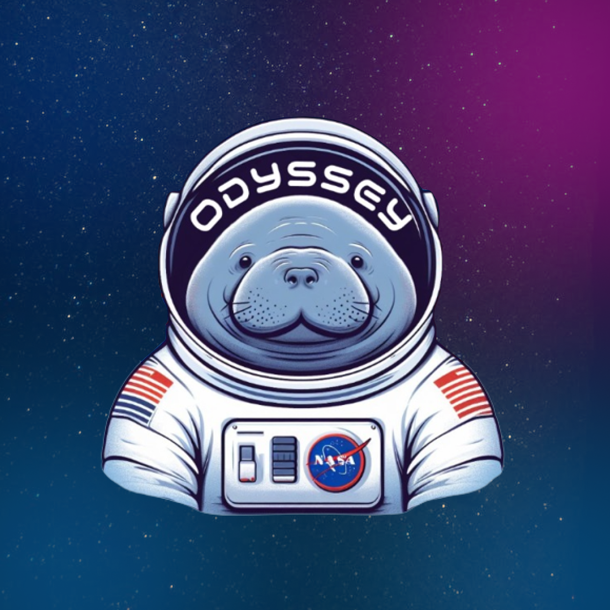

# Explore o Universo com a Odyssey Corp.

Bem-vindo ao **Odyssey** 🚀, a sua janela para o sistema solar! Com este aplicativo incrível, você poderá explorar os pontos turísticos mais impressionantes do nosso sistema solar, traçar rotas emocionantes e aprender fatos fascinantes sobre cada destino.

<!-- {width=200px height=200px} -->

## Sobre o Projeto

Odyssey é um aplicativo móvel desenvolvido em Flutter que oferece uma experiência educacional e emocionante para entusiastas do espaço, estudantes e curiosos em geral. Aqui estão algumas das principais funcionalidades do nosso aplicativo:

- 🌠 **Catálogo de Destinos**: Explore o sistema solar e descubra os pontos turísticos mais incríveis, desde os planetas gigantes até as luas misteriosas e os asteroides fascinantes.

- 📚 **Informações Detalhadas**: Cada destino oferece informações detalhadas, curiosidades e dados científicos, permitindo que você aprofunde seu conhecimento sobre o espaço.

- 🗺️ **Traçar Rotas de Turismo**: Crie rotas personalizadas para planejar sua viagem interplanetária. Escolha seus destinos favoritos e o Odyssey calculará a melhor rota para você.

<!-- - 🌌 **Realidade Aumentada**: Visualize destinos em realidade aumentada para uma experiência mais imersiva. Veja os planetas e luas como se estivesse lá.

- 🎮 **Jogos e Desafios**: Teste seus conhecimentos com jogos e desafios interativos relacionados ao espaço. -->

- 📸 **Galeria de Imagens Espaciais**: Desfrute de belas imagens e galerias de fotos dos destinos mais espetaculares do nosso sistema solar.

<!-- 
## Capturas de Tela


-->

## Instalação

Para começar sua jornada pelo espaço, siga estas etapas simples:

1. **Clone o Repositório**:

   ```bash
   git clone https://github.com/zamuelfernandes/odyssey_app.git
   ```

2. **Navegue até o Diretório do Projeto**:

   ```bash
   cd odyssey_app
   ```

3. **Instale as Dependências**:

   ```bash
   flutter pub get
   ```

4. **Execute o Aplicativo**:

   ```bash
   flutter run
   ```

## Equipe

Este projeto foi desenvolvido com amor e dedicação por uma equipe de entusiastas do espaço:

- [Samuel Fernandes](https://github.com/zamuelfernandes)
- [Caique Brandani](https://github.com/CaiqueBrandani)

## Contate-nos

Se você tiver alguma dúvida, sugestão ou simplesmente quiser dizer "olá", não hesite em entrar em contato.

Siga-nos nas redes sociais para as últimas atualizações:

- YouTube: [Odyssey Corp.](https://www.youtube.com/@OdysseyCorp.-we7qw)

Agradecemos por escolher o Odyssey Corp para a sua jornada pelo espaço. Esperamos que você tenha uma experiência celestial!

<!--  -->

**Explore o espaço. Descubra o desconhecido. Odyssey - O Universo está na palma da sua mão!** 🌌🌠
